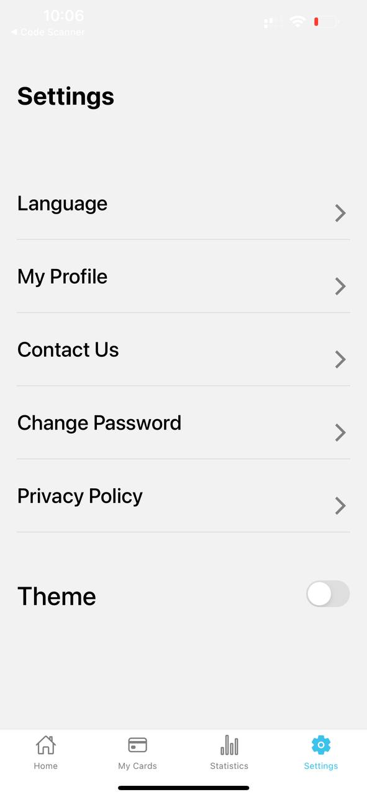
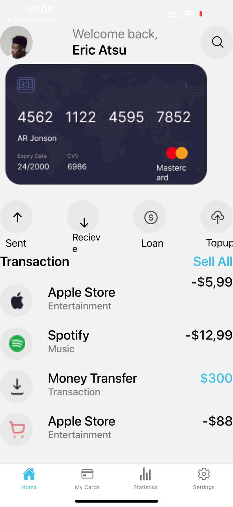

# User Information
- Name: Theodore Gyaqueh Abbey
- Student ID: 11343393

# Prerequisites

- Node.js
- npm or yarn
- React Native CLI
  

# FinanceApp

## Application Description
MyFinanceApp is a mobile application designed to manage and track financial transactions. It allows users to view card details, transaction history, and switch between light and dark themes. The application uses custom components to ensure a consistent and user-friendly experience.

## Features
- **Home Screen**: Displays user information, card details, and recent transactions.
- **Settings Screen**: Allows users to modify application settings, including theme switching.
- **Theme Switching**: Users can toggle between light and dark themes.
- **Custom Components**: Reusable custom components are used throughout the application to ensure a consistent look and feel.

## Screens and Components
### Home Screen
- **User Info**: Displays the user's name and profile picture.
- **Card Info**: Shows card details including number, expiry date, and CVV.
- **Transactions**: Lists recent transactions with icons, descriptions, and amounts.

### Settings Screen
- **Theme Switcher**: Toggle to switch between light and dark themes.
- **Other Settings**: Placeholder for additional settings options.

## How to Build the Application
1. **Set Up Development Environment**
   - Install the required development framework (React Native).
   - Set up the development environment as per the [React Native documentation](https://reactnative.dev/docs/environment-setup).

2. **Create Bottom Tabs Navigation**
   - Implement bottom tab navigation using `@react-navigation/bottom-tabs`.
   - Define routes for `Home` and `Settings` screens.

3. **Develop Home Screen**
   - Create the layout for user info, card details, and transaction history.
   - Use custom components for user info, card display, and transaction items.
   - Style the screen to match the provided design, ensuring responsiveness.

4. **Develop Settings Screen**
   - Implement a toggle switch for theme switching.
   - Use state management to handle theme changes dynamically.
   - Ensure the application updates the theme in real-time without needing to restart.

5. **Theme Switching Feature**
   - Define light and dark theme styles.
   - Apply theme styles conditionally based on the selected theme.
   - Store the user's theme preference using local storage or a state management library.

6. **Styling**
   - Use a consistent color scheme and typography to match the provided image.
   - Ensure all custom components adhere to the design guidelines.
   - Test the application in both light and dark modes to ensure proper styling.

## Custom Components
- **User Info Component**: Displays the user's name and profile picture.
- **Card Display Component**: Shows card details like number, expiry date, and CVV.
- **Transaction Item Component**: Represents individual transactions with icon, description, and amount.
- **Theme Switcher Component**: A toggle switch for changing themes.

## Installation and Running the Application
1. **Clone the Repository**
   ```sh
   git clone https://github.com/theodoreabbey173/rn-assignment5-11343393.git

# Screenshots

